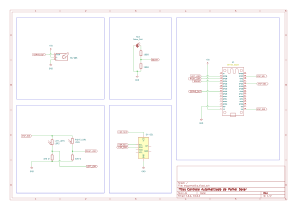

# CAPS - Controle Automatizado de Painel Solar <br> ou Girassol ESP32

Repositório para o projeto de _Arquitetura de Computadores e Tecnologias Embarcadas_ e _Eletrônica Digital_ do 7° semestre de Engenharia de Computação da Universidade São Francisco.

## Requisitos da Disciplina
- Fazer um sistema de controle que envia dados para um servidor por Wi-Fi, simulando um sistema IoT;
- Criar um dashboard para visualizar os dados.

## Resumo do Projeto 
Um sistema usando esp32 que aponta para o sentido de maior iluminação e envia dados para um servidor remoto com um dashboard, feito com Python, via HTTP.

## Organização do Repositório
```c
─┬─ esp32 //╶╶╶╶╶╶╶╶╶╶╶╶╶╶╶╶╶╶╶╶╶╶╶╶╶╶╶╶╶╶╶╶ contém o código para o esp32 na estrutura do platformio
 │   ├─ include
 │   │   ├─ README //╶╶╶╶╶╶╶╶╶╶╶╶╶╶╶╶╶╶╶╶╶╶╶ Instruções para criar o wifiDefines.h
 │   │   ├─ projectSettings.h //╶╶╶╶╶╶╶╶╶╶╶╶ Configurações para o sistema
 │   │   └╶ wifiDefines.h //╶╶╶╶╶╶╶╶╶╶╶╶╶╶╶╶ Definições para a rede e o IP do servidor
 │   ├─ lib
 │   │   ├─ controlTheory //╶╶╶╶╶╶╶╶╶╶╶╶╶╶╶╶ Biblioteca para controle PID
 │   │   │   ├─ controlTheory.h
 │   │   │   └─ controlTheory.cpp
 │   │   └─ signalConditioning //╶╶╶╶╶╶╶╶╶╶╶ Biblioteca para condicionamento de sinais
 │   │       ├─ signalConditioning.h
 │   │       └─ signalConditioning.cpp
 │   ├─ src
 │   │    └─ main.cpp //╶╶╶╶╶╶╶╶╶╶╶╶╶╶╶╶╶╶╶╶ Código principal para o esp32
 │   └─ test
 └─ server //╶╶╶╶╶╶╶╶╶╶╶╶╶╶╶╶╶╶╶╶╶╶╶╶╶╶╶╶╶╶╶ Códigos para o servidor com o dashboard
     ├─ templates
     │   └─ dashboard.html
     ├─ start-http.py //╶╶╶╶╶╶╶╶╶╶╶╶╶╶╶╶╶╶╶╶ Script para iniciar o servidor
     └─ requirements.txt
```

## Diagrama elétrico


## Melhorias Futuras
Eu pretendo fazer algumas melhorias nesse projeto ao longo do tempo, por diversão e aprendizado.
- Permitir escolher entre HTTP e MQTT;
- Reduzir o _overhead_ na transferência de dados para o dashboard;
- Usar o segundo núcleo do esp para o envio de dados, separando ele do controle;
- Implementar um controle PID completo e não apenas P;
- Realizar melhorias no protótipo físico.
  - Juntar todas as partes na mesma base;
  - Acoplar uma bateria e utilizar o painel solar para carregá-la.